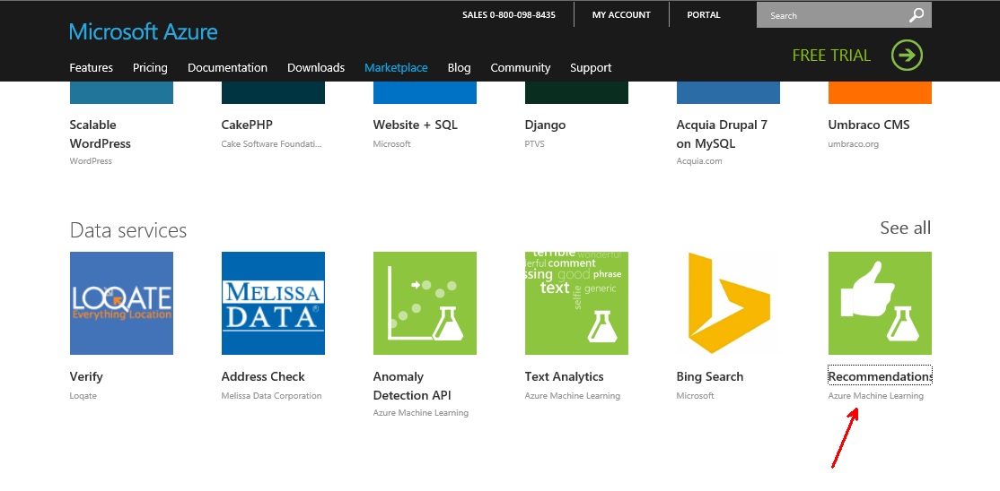
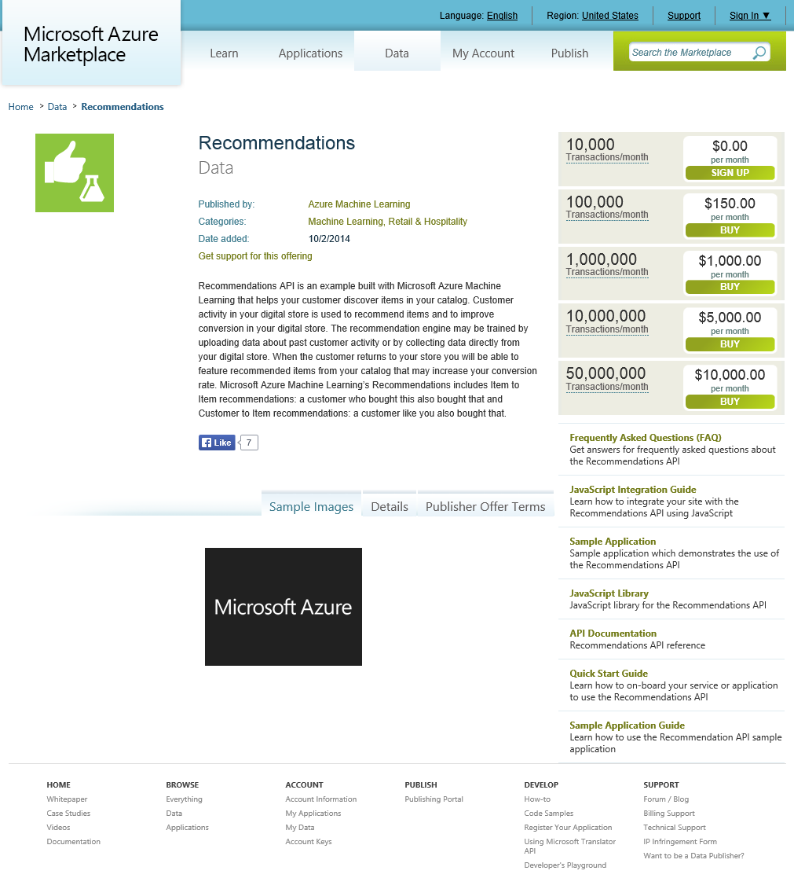

#Quelles croquettes pour Minette ?

John est quelqu'un d'extraordinaire.

Il a une imagination débordante !

Les chats ne miaulent plus sous sa fenêtre et communiquent comme des fous sur le réseau social **EntreChats**.

Les discussions tournent beaucoup autour de la nourriture et en particulier des croquettes. Et de l'eau, et du lait aussi. Peut-être qu'il pourrait aider ses amis nouvellement discrets. Boire et manger, c'est une préoccupation. 

A ce moment, l'amie de John lui crie depuis la cuisine : 
> "John, t'a pensé à re-commander des céréales pour le p'tit dej' ?"

Mais oui, c'est cela, il faut recommander.

#Recommander

John va sur le site de son cloud préféré [azure.com](http://azure.com) et se dit qu'il trouvera bien quelque chose sur la marketplace.



Il clique et se retrouve sur la [page d'accueil de ce service de recommandations](https://datamarket.azure.com/dataset/amla/recommendations). 



John parcourt les FAQ, documentations et ce service lui plait bien. Il imagine déjà les goûts de Sichahrpe, Félix et Chatouille partagés avec Minette qui pourtant ne les connaît pas. 

Sichatrpe aime bien Chéba,  XXX

#(à classer)

John récupère ses informations de connexion sur la page de son compte: 
https://datamarket.azure.com/account

La documentation de l'API est disponible [ici](http://azure.microsoft.com/en-us/documentation/articles/machine-learning-recommendation-api-documentation/).


```
using model 8eeef134-0176-4ae9-b1f3-b53c5ba68b49
Importing catalog '..\..\..\..\data\ref-catalog.txt'
catalog import report: successfully imported 11/11 lines for ref-catalog.txt
Importing usage '..\..\..\..\data\what-cats-like.txt'
catalog usage report: successfully imported 190/190 lines for what-cats-like.txt

Getting some recommendations...
        getting recommendations for [Id: 1, Name: Chébon],[Id: 2, Name: Fishtre],[Id: 8, Name: Eau du robinet]
          Name: Lait de vache, Id: 10, Rating: 0.491050417832134, Reasoning: Most popular item (default system recommendation)
          Name: Chahrnassier, Id: 3, Rating: 0.489387158300927, Reasoning: Most popular item (default system recommendation)
          Name: Chahmnivore, Id: 4, Rating: 0.487489020928745, Reasoning: Most popular item (default system recommendation)
          Name: Chahbon, Id: 5, Rating: 0.473122487811319, Reasoning: Most popular item (default system recommendation)
          Name: Lait de soja, Id: 11, Rating: 0.47274869081905, Reasoning: Most popular item (default system recommendation)

Getting some recommendations...
        getting recommendations for [Id: 7, Name: Croquis],[Id: 9, Name: Eau minérale]
          Name: Chahbon, Id: 5, Rating: 0.557292162613559, Reasoning: People who like the selected items also like 'Chahbon'
          Name: Chahrnassier, Id: 3, Rating: 0.542628287170419, Reasoning: People who like the selected items also like 'Chahrnassier'
          Name: Lait de soja, Id: 11, Rating: 0.517604631648524, Reasoning: People who like the selected items also like 'Lait de soja'
          Name: Chébon, Id: 1, Rating: 0.508597277770201, Reasoning: People who like the selected items also like 'Chébon'
          Name: Chahmnivore, Id: 4, Rating: 0.493742329205672, Reasoning: Most popular item (default system recommendation)
OK
---- done ----

```


#La suite au prochain épisode

John est serein.

Les chats aiment se faire recommander des boissons et des croquettes.

Il est content, tout cela s'est mis en place simplement, et il n'y a rien à maintenir.

Et John aime la simplicité...

**A bientôt !**
